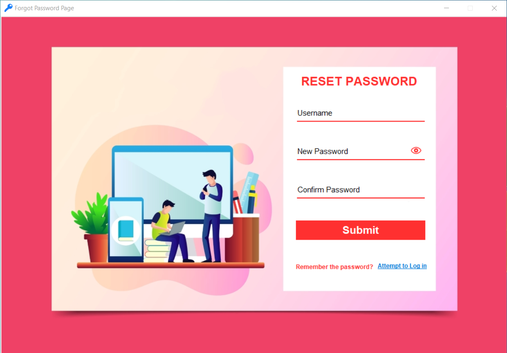

# Local Password Manager

A secure and user-friendly password manager that allows users to manage their passwords, generate random passwords, and more.

## SIGN UP PAGE


## Sign In PAGE


## FORGOT PASSWORD PAGE



## Features

- User Registration (Signup)
- User Authentication (Signin)
- Forgot Password Recovery
- Secure Password Storage
- Random Password Generator
- Edit, Delete, and Copy Passwords
- Simple and Intuitive User Interface

## Installation

1. Clone the repository:

   ```
   https://github.com/niladrighoshal/PasswordManager       ```
```
   cd PasswordManager
 ```


Then run signup or signin python file.

   
